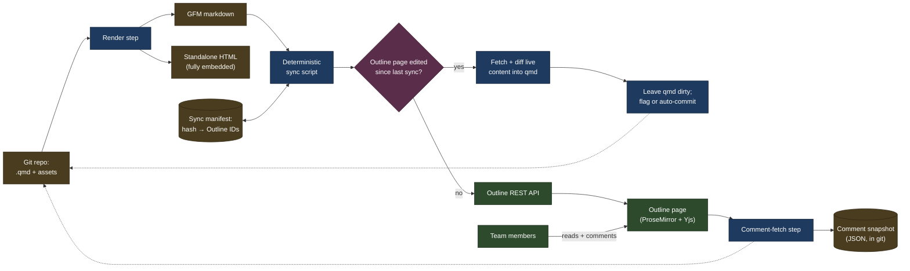

# Outline wiki publishing pipeline — design

## Purpose

This document designs a pipeline that publishes documentation (such as architecture diagrams) onto [Outline](https://www.getoutline.com), enabling all teammates to read and comment on the material.
The source material shall be revisioned in a git project, to control provenance and gate edits.

## Terminology

- **GFM** — GitHub Flavored Markdown: CommonMark (the standard markdown spec)
  plus tables, strikethrough, autolinks, and task lists. Outline's markdown
  importer targets roughly this dialect.
- **ProseMirror** — the rich-text editor framework Outline's editor is built
  on. Documents are stored internally as a ProseMirror JSON node tree, not as
  markdown or HTML; markdown is only an import/export format.
- **Yjs** — the CRDT (conflict-free replicated data type) library Outline uses
  to synchronize concurrent edits in real time. Referenced here only because
  it explains why Outline cannot ingest raw HTML or arbitrary markdown
  extensions: content must fit the fixed ProseMirror schema.
- **Comment mark** — a ProseMirror mark (an inline annotation, like bold or a
  link) that Outline attaches to the exact text span a comment is anchored to.
  The mark shares a UUID with the corresponding `Comment` record. This is the
  mechanism at the center of the comment-preservation risk discussed below.

## Architecture overview



`HTML` is a direct qmd → HTML render, independent of Outline — it's how
the standalone-single-file-export requirement is met (see below), not by
exporting back out of Outline.

The render step and the sync script are separate so the GFM output can be
diffed, tested, and dry-run independently of anything touching the network.

## P0 requirements (critical, mandatory)

| Requirement | Mechanism | Notes |
|---|---|---|
| Text, headers, bold/italic/strikethrough | GFM headings (`#`–`####`, 4 levels); `**bold**`, `*italic*`, `~~strikethrough~~` | — |
| URLs: hyperlink, and link to a header section | `[text](url)` for plain hyperlinks; a header-section link needs `page-url#h-<slug>`, where `<slug>` is the heading text lowercased with spaces turned into hyphens (confirmed on both a one-word and a two-word heading via Outline's own "copy link to heading") | A bare `[text](#slug)` fragment (no `h-` prefix, no page path) is imported verbatim and does not resolve — the render step must generate the `h-`-prefixed slug itself. Punctuation-stripping rules beyond spaces are still unverified. **Confirmed working, both same-page click and a fresh cross-page navigation (right-click → open in new window):** the full `page-url#h-<slug>` form. **Testing gotcha:** verify via a fresh navigation, not a same-page click alone — a same-page click on any bare `#fragment` (even a wrong one) can appear to "work" via the browser's own native same-page hash handling, masking a genuinely broken link. One cosmetic quirk observed: two markdown links to the identical `page-url#h-slug` target on the same page didn't behave identically on a same-page click — one jumped immediately, the other showed Outline's internal-link preview popup with an arrow to complete the jump — but both reached the correct section; harmless, not worth chasing further |
| In-place rendered image, incl. animated GIF | Upload via `attachments.createUpload`, then `` | — |
| Inline code, inline math `$…$`, block math `$$…$$` | Backtick inline code; Outline's editor uses KaTeX for `$…$` inline and `$$…$$` display blocks (also reachable via `/math`) | **Confirmed:** multi-line block math renders correctly with an explicit `\newline` between lines |
| Mermaid diagrams | Fenced ` ```mermaid ` block, rendered live with a source/diagram toggle | In-place rendered. **Confirmed:** `classDef`/`fill`/`stroke`/`color` styling survives Outline's renderer unsanitized — a 4-class palette rendered with distinct, correct colors per class |
| Tables with text formatting | GFM pipe tables; inline formatting works inside cells | — |
| Sync onto an Outline page; get/snapshot its version | `documents.create` (short docs) / `documents.import` (bypasses the ~7,500-char limit on `documents.create`'s `text` field), then `documents.update` on later syncs; **confirmed:** it's `revisions.list` (not `documents.revisions`), same `documentId` payload, to snapshot before each overwrite | Always update the same `documentId` — never delete+recreate — see [comment-anchoring risk](#empirical-tests) |
| Collaborative comments from the team | Outline's native inline commenting | — |
| Programmatic comment retrieval: source, timestamp, content, threads, other metadata | `comments.list` / `comments.info`, with `includeAnchorText` to recover the text a comment is anchored to | **Confirmed:** threading is `parentCommentId`. **Confirmed:** `comments.create` accepts only `documentId`/`text`/`parentCommentId` — no anchor/range field exists on the `Comment` schema at all, even with `includeAnchorText`. An anchor only exists for comments a human creates by selecting text in the UI; there is no way to create an anchored comment via the API |

## P1 requirements (desired; degrade gracefully if unavailable)

| Requirement | Mechanism | Notes |
|---|---|---|
| In-place rendered video (private file or public provider) | No reliable in-place mechanism via markdown import. Use a plain text link for a private attachment; a public provider URL (YouTube/etc.) renders as inert plaintext, not an embed | **Confirmed unreliable, reversed from an earlier finding:** the image-style `` embed for a private attachment worked once, then silently broke on a later resync (attachment stayed reachable via the API; the page showed no discoverable URL) — not worth relying on. **Confirmed:** a bare public-provider URL (tested with a YouTube link) imported via markdown renders as plain, non-embedded text — Outline's allowlisted rich-embed mechanism triggers only on a real paste-into-editor interaction, not on markdown import, so it's unreachable from this pipeline regardless of provider. Workaround for both cases: a plain link/URL, accept no inline player |
| Vector images (SVG) | Upload as an attachment like any other image — `attachments.create` accepts an arbitrary `contentType`, and browsers render `` natively | **Confirmed:** renders inline like any raster image |
| Export to standalone, single-embedded-file HTML | The `HTML` branch in the architecture diagram above renders the `.qmd` directly to a single self-contained file | Met outside Outline — Outline's own HTML export writes separate asset files, so this is satisfied by not routing through Outline at all |
| Auto-generated banner on the Outline page | Fixed banner block inserted by the render step, noting the source repo | See [Sync script](#sync-script) |

## Not supported

Outline has no mechanism for these. Each has a workaround if the effect
matters enough to reproduce another way.

- **URL to an arbitrary bookmark within a page** — anchors exist only at
  heading granularity. Workaround: insert a heading at the target point.
- **Font size** — only heading levels (H1–H4) and body text exist, no
  independent point-size control. Workaround: use heading level as a proxy.
- **Font (foreground) color** — only background highlight color, in a fixed
  palette, is available. **Confirmed:** tested on a heading — a fixed set of
  colors, no custom color input. Long-standing open request:
  [#6693](https://github.com/outline/outline/discussions/6693),
  [#2003](https://github.com/outline/outline/discussions/2003),
  [#7262](https://github.com/outline/outline/discussions/7262). Workaround:
  use highlight color instead.
- **Table cell background color** — no per-cell shading. Workaround:
  bold/highlighted cell text, an emoji/status marker, or a callout block.
- **Side-by-side text/image/table (1×2, 1×3 layout)** — no columns block;
  nested tables are fragile. Workaround: a table used purely as a layout
  container — **confirmed** a cell renders a full inline image (with
  caption, row auto-expanding to fit), not a broken reference or thumbnail
  — or stack vertically.

## Sync script

Source is `.qmd` only, not plain `.md` — `.qmd` is a strict superset (GFM
plus Quarto's YAML front matter, cross-refs, callouts), and the HTML export
path already requires Quarto, so there's no format-detection branch to
maintain. A deterministic script calling Outline's REST API directly enables
publishing.

### Attachment upload and deduplication

Outline's API gives no evidence of built-in content-based deduplication:
`attachments.create`'s documented request fields are `name`, `documentId`,
`contentType`, and `size` — no checksum/hash field, no `duplicate_of`-style
response. Left alone, re-running the sync script on an unchanged image would
upload it again every time, producing an attachment graveyard.

Deduplication therefore has to live in the pipeline, not the API:

- Maintain a **sync manifest** (a JSON file committed to git, or state
  tracked alongside it) mapping `sha256(file bytes) → {Outline attachment id,
  attachment URL, source path, uploaded_at}`.
- Before uploading any image/video, hash it locally. If the hash is already
  in the manifest, reuse the stored URL and skip the upload entirely.
- If the hash for a given source path has changed since the last sync, upload
  the new bytes, record the new hash/URL, and rewrite the markdown reference
  before publishing — old attachment rows become unreferenced but are not
  auto-deleted (no bulk "delete unused attachments" endpoint is surfaced
  above; treat cleanup as a separate, explicitly-invoked maintenance step,
  since an attachment could still be referenced from a comment or another
  page).
- Key the manifest by content hash rather than by file path, so renaming or
  moving a source image in the repo doesn't trigger a spurious re-upload.

### Sync steps

1. Render `.qmd` → GFM (mermaid blocks passed through as literal source,
   not rasterized), including the auto-generated source banner.
2. Resolve every local image/video reference against the attachment
   manifest above; upload only what's missing or changed.
3. Rewrite the compiled markdown's asset links to the resolved Outline
   attachment URLs.
4. Look up the target document's ID from a repo-tracked mapping (e.g. a
   front-matter field in the `.qmd` or a sidecar `outline_map.json`).
5. **Reconcile manual edits.** Fetch the page's current revision/`updatedAt`
   and compare against what the manifest recorded after the *last successful
   sync*. If it changed out-of-band, someone edited the page body directly in
   Outline (not just commented):
   1. Download the live content via `documents.info`.
   2. Diff it against the last-synced content to isolate the manual edit.
   3. Patch that delta into the `.qmd` source, then re-render and confirm
      the output is textually equivalent to the live Outline content
      (round-trip parity check).
   4. Leave the working tree dirty and stop the sync, flagging the user for
      review — unless `--auto-commit` was passed, in which case commit the
      patched `.qmd` and continue the sync.
6. Snapshot existing comments (full content, authorship, timestamps, thread
   structure, anchor text via `includeAnchorText`) to a JSON artifact in git,
   immediately before overwriting the page — note which root comments have a
   non-null `anchorText`, since those are the ones about to lose it.
7. Snapshot the page's current revision via `revisions.list` before
   writing, so this sync is rollback-able independent of git history.
8. Push via `documents.update`/re-import against the existing `documentId`.
9. For every thread flagged in step 6 as previously anchored, post a reply
   (`comments.create` with `parentCommentId`) noting the anchor was reset by
   this sync and asking the reviewer to re-check it still applies — see
   [comment-anchoring risk](#empirical-tests). This runs on every
   sync with pre-existing anchored comments, not just when content changed.
10. Record the new revision/`updatedAt` back into the manifest.
11. Support a `--dry-run` mode that performs steps 1–4 and prints a diff of
    what would change, without calling any write endpoint.

Two more things worth building in rather than bolting on later: a
least-privilege API key (confirm whether Outline's key scopes can be
restricted to specific collections, rather than issuing a
workspace-admin-equivalent key to the sync job), and rate-limit backoff on
429s (the general API limit is documented around 1000 requests/minute/IP,
tighter on specific expensive endpoints like export — relevant once a run
uploads many attachments).

The key itself is read from an `OUTLINE_API_KEY` environment variable, never
committed or written to disk by the script.

**Confirmed:** a personal API key's `auth.info` policy abilities mirror the
issuing user's own member-level workspace permissions — there is no
collection-restricted scope. Least-privilege here means using a dedicated
service-account user with the narrowest role Outline allows, not a scope
flag on the key itself.

## Local validation

Validates the `.qmd` before anything touches Outline — mermaid/Quarto
compile, math delimiters balance, URLs resolve. Lives in `src/validate.py`
as a library module; `sync.py` is the only CLI entrypoint and runs this
validation as a gate by default before every sync (`--skip-validate` to
bypass it, `--validate-only` to run just the gate without syncing). Not
wired as a pre-commit hook — that's still a later decision if it turns out
to be worth the friction.

## Empirical tests

All P0/P1 mechanisms and the "Not supported" list above were validated
against the real Rivet Outline workspace (`Core SW > Misc > "Outline Wiki
Test Page"`, backed by `example/sample.qmd`, a fixture with no subject
matter of its own exercising every requirement) rather than assumed from
documentation. Confirmed field names, pulled from live responses rather than
the OpenAPI spec: `Comment` — `id`, `data` (ProseMirror JSON body,
which can itself embed rich content like images), `documentId`,
`parentCommentId`, `createdBy`/`createdById`, `resolvedAt`/`resolvedBy`/
`resolvedById`, `reactions`, and `anchorText` (only present, via
`includeAnchorText`, on a root comment created by selecting text in the UI).
`Document` — `revision` (incrementing int) and `updatedAt` (ISO timestamp)
at the top level of every `documents.*` response.

**Biggest architecture risk: comment anchoring across content updates —
confirmed.** Outline anchors an inline comment via a comment mark — a
ProseMirror mark sharing a UUID with the `Comment` record, which has no
independent position/text field of its own (confirmed: `comments.list` with
`includeAnchorText` returns no anchor-related field at all for an
API-created comment). Tested directly: created a UI-anchored comment on a
heading (`anchorText: "MP4 "` came back correctly), then called
`documents.update` with the **exact same text already on the page** —
byte-for-byte, no content change. Result: all 3 comments (including a
threaded reply with an embedded image) survived as records with threading
intact, but the root comment's `anchorText` came back `null` — the anchor
was detached by the resync itself, not by any actual edit.

- **Confirmed:** `documents.update` never drops comment threads, but
  unconditionally detaches their inline anchor on every call, even a
  no-op resync. This makes the sync script's job strictly about preserving
  the `Comment` records (already true today, no action needed) — anchor
  loss on every sync is now the expected, unavoidable steady state, not an
  edge case to prevent.
- Given anchor loss is unconditional, the bot-reply mitigation is no longer
  optional-if-it-happens: post a reply on every pre-existing thread after
  each sync, noting the anchor was reset and asking the reviewer to
  re-check it still applies to the intended text. Build this into the sync
  script's standard steps, not as a fallback.
- **Confirmed working end-to-end** via `sync.py`: the pre-push comment
  snapshot (step 6) captures `anchorText` while it's still intact, so the
  bot reply quotes the original anchor text ("this thread was anchored to
  'diagram'...") rather than only saying an anchor was reset — the one
  piece of context that would otherwise be lost forever the moment the push
  detaches it.
- **Confirmed:** the round-trip parity check cannot be a raw byte/text
  compare. Pushing text and immediately re-fetching it back showed Outline's
  markdown exporter re-pads GFM tables — widening the `---` separator and
  padding cell content to align columns — even when nothing semantic
  changed. Everything else in this test document round-tripped identically.
  The parity check (and the manual-edit reconciliation diff) must normalize
  table whitespace/padding before comparing, or compare parsed markdown
  ASTs instead of raw text.
- **Observed:** pushing a `documents.update` while a viewer has the page
  open live can show a transient broken-attachment glitch (gray box, no
  preview) client-side until they refresh — Outline's live editor syncs over
  a separate real-time channel (Yjs/websockets) that a plain REST overwrite
  bypasses. Confirmed not data loss: the underlying attachment stayed
  reachable (`attachments.redirect` → signed URL → `200`) throughout.
