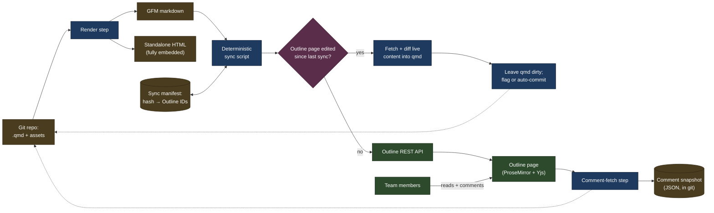

# Outline wiki publishing pipeline — design

## Purpose

This document designs a pipeline that publishes documentation (such as architecture diagrams) onto [Outline](https://www.getoutline.com), enabling all teammates to read and comment on the material.
The source material shall be revisioned in a git project, to control provenance and gate edits.

## Terminology

- **GFM** — GitHub Flavored Markdown: CommonMark (the standard markdown spec)
  plus tables, strikethrough, autolinks, and task lists. Outline's markdown
  importer targets roughly this dialect.
- **ProseMirror** — the rich-text editor framework Outline's editor is built
  on. Documents are stored internally as a ProseMirror JSON node tree, not as
  markdown or HTML; markdown is only an import/export format.
- **Yjs** — the CRDT (conflict-free replicated data type) library Outline uses
  to synchronize concurrent edits in real time. Referenced here only because
  it explains why Outline cannot ingest raw HTML or arbitrary markdown
  extensions: content must fit the fixed ProseMirror schema.
- **Comment mark** — a ProseMirror mark (an inline annotation, like bold or a
  link) that Outline attaches to the exact text span a comment is anchored to.
  The mark shares a UUID with the corresponding `Comment` record. See
  [Comment anchoring](#comment-anchoring).

## Architecture overview



`HTML` is a direct qmd → HTML render, independent of Outline — it's how
the standalone-single-file-export requirement is met, not by exporting
back out of Outline.

The render step and the sync script are separate so the GFM output can be
diffed, tested, and dry-run independently of anything touching the network.

## P0 requirements (critical, mandatory)

| Requirement | Mechanism | Notes |
|---|---|---|
| Text, headers, bold/italic/strikethrough | GFM headings (`#`–`####`, 4 levels); `**bold**`, `*italic*`, `~~strikethrough~~` | — |
| URLs: hyperlink, and link to a header section | `[text](url)` for plain hyperlinks; a header-section link needs `page-url#h-<slug>`, where `<slug>` is the heading text lowercased with spaces converted to hyphens | A bare `[text](#slug)` fragment (no `h-` prefix, no page path) is left as literal text on import and does not resolve — the render step generates the `h-`-prefixed slug itself. Verify links via a fresh cross-page navigation, not a same-page click — a same-page click can appear to work via the browser's native hash handling even when the target is wrong |
| In-place rendered image, incl. animated GIF | Upload via `attachments.createUpload`, then `` | — |
| Inline code, inline math `$…$`, block math `$$…$$` | Backtick inline code; Outline's editor uses KaTeX for `$…$` inline and `$$…$$` display blocks (also reachable via `/math`) | Multi-line block math needs an explicit `\newline` between lines |
| Mermaid diagrams | Fenced ` ```mermaid ` block, rendered live with a source/diagram toggle | `classDef`/`fill`/`stroke`/`color` styling survives Outline's renderer unsanitized |
| Tables with text formatting | GFM pipe tables; inline formatting works inside cells | Outline's markdown exporter re-pads table separators/cells on export — see [Round-trip parity](#round-trip-parity) |
| Sync onto an Outline page; get/snapshot its version | `documents.create` on a first sync, `documents.update` on later syncs; `revisions.list` (not `documents.revisions`) to snapshot before each overwrite | Always update the same `documentId` — never delete+recreate — see [Comment anchoring](#comment-anchoring). `documents.create`'s `text` field has a ~7,500-char limit — see [Remaining gaps](#remaining-gaps) |
| Collaborative comments from the team | Outline's native inline commenting | — |
| Programmatic comment retrieval: source, timestamp, content, threads, other metadata | `comments.list` / `comments.info`, with `includeAnchorText` to recover the text a comment is anchored to | Threading is `parentCommentId`. The `Comment` schema has no anchor/range field — an anchor exists only for a comment a human creates by selecting text in the UI; there is no way to create an anchored comment via the API |

## P1 requirements (desired; degrade gracefully if unavailable)

| Requirement | Mechanism | Notes |
|---|---|---|
| In-place rendered video (private file or public provider) | No reliable in-place mechanism via markdown import. Use a plain text link | An image-style `` embed for a private attachment can render as a playable card, but has been observed to silently break on a later resync. A public-provider URL (tested with YouTube) imports as inert plaintext — Outline's rich-embed allowlist triggers only on a real paste-into-editor interaction, not on markdown import |
| Vector images (SVG) | Upload as an attachment like any other image — `attachments.create` accepts an arbitrary `contentType` | Renders inline like any raster image |
| Export to standalone, single-embedded-file HTML | The `HTML` branch in the architecture diagram renders the `.qmd` directly to a single self-contained file | Met outside Outline — Outline's own HTML export writes separate asset files, so this is satisfied by not routing through Outline at all |
| Auto-generated banner on the Outline page | Fixed banner block noting the source repo, inserted by the render step | Not implemented — see [Remaining gaps](#remaining-gaps) |

## Not supported

Outline has no mechanism for these. Each has a workaround if the effect
matters enough to reproduce another way.

- **URL to an arbitrary bookmark within a page** — anchors exist only at
  heading granularity. Workaround: insert a heading at the target point.
- **Font size** — only heading levels (H1–H4) and body text exist, no
  independent point-size control. Workaround: use heading level as a proxy.
- **Font (foreground) color** — only background highlight color, in a fixed
  palette, is available. Long-standing open request:
  [#6693](https://github.com/outline/outline/discussions/6693),
  [#2003](https://github.com/outline/outline/discussions/2003),
  [#7262](https://github.com/outline/outline/discussions/7262). Workaround:
  use highlight color instead.
- **Table cell background color** — no per-cell shading. Workaround:
  bold/highlighted cell text, an emoji/status marker, or a callout block.
- **Side-by-side text/image/table (1×2, 1×3 layout)** — no columns block;
  nested tables are fragile. Workaround: a table used purely as a layout
  container — a cell renders a full inline image (with caption, row
  auto-expanding to fit) — or stack vertically.

## Sync script

Source is `.qmd` only, not plain `.md` — `.qmd` is a strict superset (GFM
plus Quarto's YAML front matter, cross-refs, callouts), and the HTML export
path already requires Quarto, so there's no format-detection branch to
maintain. A deterministic script calling Outline's REST API directly enables
publishing.

### Attachment upload and deduplication

Outline's API has no built-in content-based deduplication:
`attachments.create`'s request fields are `name`, `documentId`,
`contentType`, and `size` — no checksum/hash field, no `duplicate_of`-style
response. Left alone, re-running the sync script on an unchanged image would
upload it again every time, producing an attachment graveyard.

Deduplication therefore lives in the pipeline, not the API:

- A **sync manifest** (a JSON file, keyed by `sha256(file bytes)`) maps to
  `{Outline attachment id, attachment URL, source path, uploaded_at}`.
- Before uploading any image/video, hash it locally. If the hash is already
  in the manifest, reuse the stored URL and skip the upload entirely.
- If the hash for a given source path has changed since the last sync, upload
  the new bytes and record the new hash/URL. Old attachment rows become
  unreferenced but are not auto-deleted (no bulk "delete unused attachments"
  endpoint exists; an attachment could still be referenced from a comment or
  another page, so cleanup is a separate, explicitly-invoked step).
- The manifest is keyed by content hash rather than file path, so renaming or
  moving a source image doesn't trigger a spurious re-upload.

### Sync steps

1. Render `.qmd` → GFM (mermaid blocks passed through as literal source,
   not rasterized).
2. Resolve every local image/video reference against the attachment
   manifest above; upload only what's missing or changed.
3. Rewrite the compiled markdown's asset links to the resolved Outline
   attachment URLs.
4. Look up the target document's ID from the `.qmd`'s own front matter
   (`outline_id`; absent on a first sync, written back after one).
5. **Reconcile manual edits.** Compare the live document's `updatedAt`
   against the value recorded after the last successful sync. If it
   changed, compare the live text against what was last synced (table
   whitespace normalized — see [Round-trip parity](#round-trip-parity)); if
   the content genuinely differs, replace the `.qmd` body wholesale with
   the live content, then re-render and confirm parity. Leave the working
   tree dirty and stop, flagging the user for review — unless
   `--auto-commit` was passed, in which case commit the patched `.qmd` and
   continue. This is a whole-body replace, not a merge: if the `.qmd` was
   also edited locally since the last sync, review the diff before
   trusting `--auto-commit`.
6. Snapshot existing comments (full content, authorship, timestamps, thread
   structure, anchor text via `includeAnchorText`) to a JSON artifact,
   immediately before overwriting the page — this captures each root
   comment's `anchorText` while it's still intact, since the push below is
   about to detach it.
7. Snapshot the page's current revision history via `revisions.list` before
   writing, so this sync is rollback-able independent of git history.
8. Push via `documents.update` against the existing `documentId`.
9. For every thread that had a non-null `anchorText` in the step 6
   snapshot, post a reply (`comments.create` with `parentCommentId`)
   quoting the original anchor text and noting the anchor was reset by this
   sync — see [Comment anchoring](#comment-anchoring). This runs on every
   sync with pre-existing anchored comments, not only when content changed.
10. Record the new revision/`updatedAt` back into the manifest and front
    matter.
11. `--dry-run` performs steps 1–4 and prints a diff of what would change,
    without calling any write endpoint.

Outline's API key scopes mirror the issuing user's own workspace
permissions — there is no collection-restricted key scope. Least privilege
here means running the sync under a dedicated service-account user with the
narrowest role Outline allows, not a scope flag on the key itself. The key
is read from `OUTLINE_API_KEY`; the script never writes it to disk.

## Local validation

Validates the `.qmd` before anything touches Outline — mermaid/Quarto
compile, math-delimiter balance, URL reachability. Lives in
`src/validate.py` as a library module; `sync.py` is the sole CLI entrypoint
and runs this as a gate by default before every sync (`--skip-validate` to
bypass it, `--validate-only` to run just the gate).

## Comment anchoring

Outline anchors an inline comment via a comment mark — a ProseMirror mark
sharing a UUID with the `Comment` record, which has no independent
position/text field of its own. Every `documents.update` call —
including one that pushes back byte-identical content — unconditionally
detaches this mark. The underlying `Comment` record is never dropped
(threading and content survive), only its inline position: `anchorText`
comes back `null` on the next fetch, regardless of whether the sync's
content actually changed anything.

This makes anchor loss the expected, unavoidable steady state of every
sync, not an edge case. The mitigation (sync steps 6 and 9) is built into
the standard flow rather than treated as a fallback: comment anchor text is
snapshotted immediately before each push, and every previously-anchored
thread gets an automated reply quoting what it used to point at and asking
the reviewer to re-check it still applies.

## API schema notes

Field names below are taken from live API responses, not the OpenAPI spec.

- `Comment` — `id`, `data` (ProseMirror JSON body, which can itself embed
  rich content like images), `documentId`, `parentCommentId`,
  `createdBy`/`createdById`, `resolvedAt`/`resolvedBy`/`resolvedById`,
  `reactions`, and `anchorText` (present, via `includeAnchorText`, only on
  a root comment created by selecting text in the UI).
- `Document` — `revision` (incrementing int) and `updatedAt` (ISO
  timestamp) at the top level of every `documents.*` response.

## Round-trip parity

Outline's markdown exporter re-pads GFM tables on export — widening the
`---` separator and padding cell content to align columns — even when
nothing semantic changed. Everything else round-trips identically. Any
text comparison against live Outline content (the manual-edit
reconciliation diff, the parity check after patching) must normalize table
whitespace/padding before comparing, not do a raw byte/text compare.

## Live-viewer sync behavior

Pushing a `documents.update` while a viewer has the page open live can
show a transient broken-attachment glitch (gray box, no preview)
client-side until they refresh — Outline's live editor syncs over a
separate real-time channel (Yjs/websockets) that a plain REST overwrite
bypasses. This is not data loss: the underlying attachment stays reachable
(`attachments.redirect` → signed URL → `200`) throughout.

## Remaining gaps

- Heading-slug generation only handles the confirmed rule (lowercase,
  spaces → hyphens); punctuation-stripping beyond that is unverified
  against Outline's actual slug algorithm for headings containing
  punctuation.
- Rate-limit backoff (HTTP 429) is not implemented in `outline_client.py`.
  The general API limit is documented around 1000 requests/minute/IP,
  tighter on specific expensive endpoints — relevant once a run uploads
  many attachments.
- The auto-generated source banner (P1) is not implemented — `render.py`
  does not insert one yet.
- `validate.py`'s checks are wired into `sync.py` as a pre-sync gate but
  not as a pre-commit hook.
- Table-cell tolerance is confirmed for a single embedded image per cell;
  multi-element or heavily formatted cell content is untested.
- `documents.import` (needed to bypass `documents.create`'s ~7,500-char
  limit on the first sync of a large `.qmd`) is not implemented —
  `create_document` only calls `documents.create`, so a large first-ever
  sync can fail where a resync of the same content would not.
