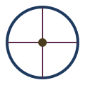
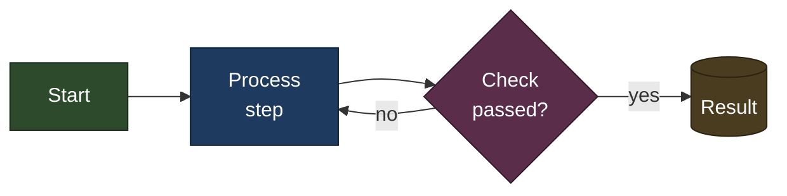
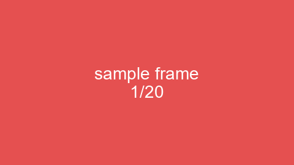

The tables below are the requirements of the outline-wiki sync project.
Each section further down demonstrates one requirement live, so resyncing
this page exercises the whole pipeline end-to-end.

## P0 requirements (critical, mandatory)

| Requirement | Mechanism |
|---|---|
| Text, headers, bold/italic/strikethrough | GFM headings (used throughout this page); **bold**, *italic*, and ~~strikethrough~~ together |
| URLs: hyperlink, and link to a header section | A [hyperlink](https://www.getoutline.com) and a link to the [Images section](#images) below |
| In-place rendered image, incl. animated GIF | Upload as attachment, then `` |
| Inline code, inline math `$…$`, block math `$$…$$` | Backtick code; KaTeX for `$…$` and `$$…$$` |
| Mermaid diagrams | Fenced ` ```mermaid ` block, rendered live |
| Tables with text formatting | GFM pipe tables; a cell can hold **formatted** text or an image:  |
| Sync onto a page; get/snapshot its version | `documents.create`/`.update`; `revisions.list` to snapshot |
| Collaborative comments from the team | Outline's native inline commenting |
| Programmatic comment retrieval (source, timestamp, threads) | `comments.list`/`.info` with `includeAnchorText` |

## P1 requirements (desired; degrade gracefully)

| Requirement | Mechanism |
|---|---|
| Video (private file or public provider) | No reliable in-place embed via markdown import; plain link only |
| Vector images (SVG) | Upload as an attachment like any other image |
| Export to standalone, single-file HTML | Direct `.qmd` → HTML render, independent of Outline |

## Code and math

Inline code: `sample_variable`. Inline math: $E = mc^2$. Block math:

$$
\int_0^\infty e^{-x^2}\,dx = \frac{\sqrt{\pi}}{2}
$$

Multiline block math (testing `\newline`):

$$
a + b = c \newline
d + e = f
$$

Multiline code block:

```python
def add(a: int, b: int) -> int:
    return a + b
```

## Mermaid diagram



## Images

A static image:


An animated GIF (changing color + text):



A vector image:


## Video

A locally-hosted MP4 (P1): image-style embed proved unreliable across
resyncs (worked once, then silently broke). Use a plain text link instead:

[Download: sample video (MP4)](assets/sample_video.mp4)

A public provider URL: confirmed this renders as inert plaintext via
markdown import, not an embed (Outline's rich-embed allowlist only
triggers on a real paste-into-editor interaction):

https://www.youtube.com/watch?v=dQw4w9WgXcQ
