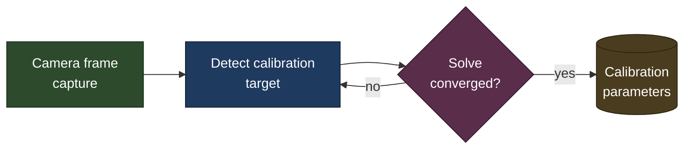
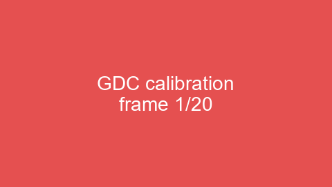
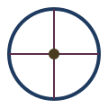

# Outline Wiki Test Page

This page is a **test fixture**: every section below exercises one of the
requirements in the tables underneath, so a resync of this file confirms
the whole pipeline still works end-to-end. "GDC" (geometric display
calibration) is used below only as a plausible subject for the sample
content, not real calibration data.

### P0 requirements (critical, mandatory)

| Requirement | Mechanism |
|---|---|
| Text, headers, bold/italic/strikethrough | GFM headings; `**bold**`, `*italic*`, `~~strikethrough~~` |
| URLs: hyperlink, and link to a header section | `[text](url)`; header link needs `page-url#h-<slug>` |
| In-place rendered image, incl. animated GIF | Upload as attachment, then `` |
| Inline code, inline math `$…$`, block math `$$…$$` | Backtick code; KaTeX for `$…$` and `$$…$$` |
| Mermaid diagrams | Fenced ` ```mermaid ` block, rendered live |
| Tables with text formatting | GFM pipe tables; inline formatting works in cells |
| Sync onto a page; get/snapshot its version | `documents.create`/`.update`; `revisions.list` to snapshot |
| Collaborative comments from the team | Outline's native inline commenting |
| Programmatic comment retrieval (source, timestamp, threads) | `comments.list`/`.info` with `includeAnchorText` |

### P1 requirements (desired; degrade gracefully)

| Requirement | Mechanism |
|---|---|
| Video (private file or public provider) | No reliable in-place embed via markdown import — plain link only |
| Vector images (SVG) | Upload as an attachment like any other image |
| Export to standalone, single-file HTML | Direct `.qmd` → HTML render, independent of Outline |

## Text formatting

Plain text, **bold**, *italic*, and ~~strikethrough~~ all in one sentence to
confirm they compose. A [plain hyperlink](https://www.getoutline.com) and a
[link to the Tables section below](#tables) test both URL forms — `sync.py`
rewrites the bare `#tables` fragment into the confirmed working
`page-url#h-tables` form automatically (verify via a fresh navigation, not
a same-page click).

## Inline code and math

Inline code: `calibration_offset_mm`. Inline math: $E = mc^2$. Block math:

$$
\int_0^\infty e^{-x^2}\,dx = \frac{\sqrt{\pi}}{2}
$$

Multiline block math (testing `\newline`):

$$
a + b = c \newline
d + e = f
$$

## Mermaid diagram



## Images

A static image:



An animated GIF (changing color + text):


A vector image (P1):



## Video

A locally-hosted MP4 (P1) — image-style embed proved unreliable across
resyncs (worked once, then silently broke). Use a plain text link instead:

[Download: calibration video (MP4)](assets/gdc_calibration.mp4)

A public provider URL — confirmed this renders as inert plaintext via
markdown import, not an embed (Outline's rich-embed allowlist only
triggers on a real paste-into-editor interaction):

https://www.youtube.com/watch?v=dQw4w9WgXcQ

## Tables

| Axis | Offset (mm) | Status |
|---|---|---|
| **X** | 0.12 | ✅ *pass* |
| **Y** | -0.08 | ✅ *pass* |
| **Z** | 1.4 | ⚠️ **recheck** |

## Table cell image tolerance

| Label | Preview |
|---|---|
| Target |  |
| Icon |  |

## Wrap-up

If every section above rendered as intended, this confirms the P0/P1 tables
above end-to-end for a real Outline workspace.
